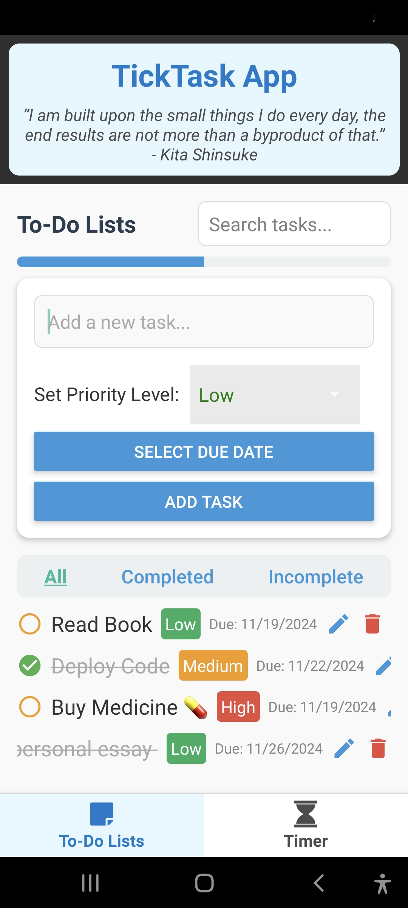
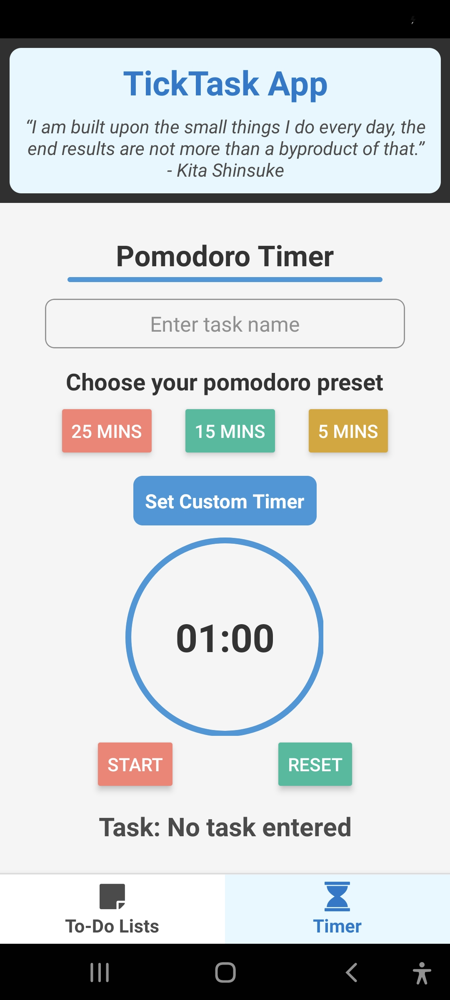

# 📱 TickTask App  

TickTask is an easy-to-use React Native app that helps you manage tasks and time effectively. Whether you need a powerful to-do list or an intuitive timer, TickTask has you covered!  

---

## 🖌️ App Preview  

<div align="center">
  
  &nbsp;&nbsp;&nbsp;&nbsp;&nbsp;&nbsp;&nbsp;&nbsp;&nbsp;&nbsp;&nbsp;
  
</div>


## 🚀 Features  

### 📝 To-Do List Features   
- **Add Tasks**: Effortlessly create tasks with a few taps.  
- **Edit and Delete Tasks**: Modify or remove tasks as needed.  
- **Search Tasks**: Quickly find tasks using the search functionality.  
- **Priority Levels**: Organize tasks by setting high, medium, or low priorities.  
- **Due Dates**: Stay on track with tasks by setting due dates.  
- **Complete/Incomplete Sections**: Mark tasks as complete or incomplete and view them based on their completion status.

### ⏱️ Timer Features  
- **Start, Pause, Reset**: Seamlessly control the timer for flexible time management.  
- **Progress Circle**: Visualize elapsed and remaining time with an interactive progress circle.  
- **Pomodoro Presets**: Focus and increase productivity with Pomodoro-based timer presets.  
- **Tab Bar Navigation**: Jump from To-do-list tab to Timer tab effortlessly. 

---

## 🛠️ Tools and Technologies Used  
TickTask is built using modern tools and technologies to ensure a seamless user experience:

### **Frontend**  
- **React Native**: For building a robust cross-platform mobile app.  
- **JavaScript/TypeScript**: For writing efficient, scalable code.  
- **React Navigation**: For handling seamless app navigation.

### **UI Components**  
- **React Native Paper**: For polished and responsive UI elements.  
- **React Native SVG**: For rendering scalable vector graphics (e.g., progress circles).  
- **react-native-svg-charts**: For displaying progress visuals in the timer.  

### **State Management**  
- **React Hooks**: To manage the app's local state effectively.

### **Development Tools**  
- **Android Studio**: For testing and debugging on Android devices.  
- **Visual Studio Code**: As code editor.

### **Version Control**  
- **Git & GitHub**: For version control and repository management.

---

## Installation  

Get started with TickTask by following these simple steps:  

### Prerequisites  
- **Node.js**: Version 14+ recommended.  
- **React**: A JavaScript library for building user interfaces. 
- **React Native**: Framework for building mobile apps using React. 
- **npm** or **Yarn**: Dependency manager.  
- **Android Studio**: For running on Android devices.  
- **react-native-cli**: To initialize and manage React Native projects.  
- **JDK**: Required for Android development.  

### Steps  

1. Clone the repository:  
   ```bash  
   git clone https://github.com/dipeshduwal/tick-task-app.git  
   cd tick-task-app
   ``` 


2. Install project dependencies:
   ```bash
   npm install
   ```

3. Start the Metro server:
```bash
# using npm
npm start

# OR using Yarn
yarn start
```

4. Run the app:

### For Android

```bash
# using npm
npm run android

# OR using Yarn
yarn android
```